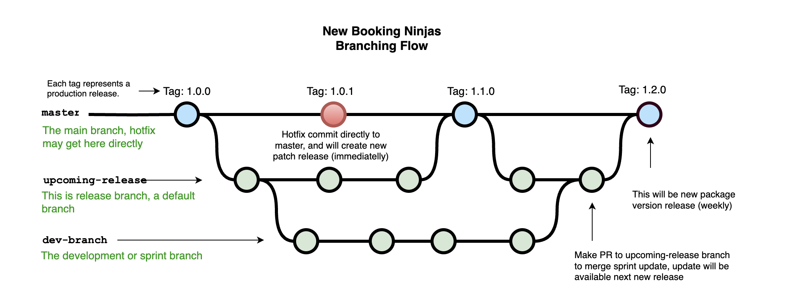

Branching flow

# Type of commits

The type is responsible for telling us what change or iteration is being made, from the convention rules, we have the following types:

`test`: indicates any type of creation or alteration of test codes.
Example: Creation of unit tests.

`feat`: indicates the development of a new feature for the project.
Example: Adding a service, functionality, endpoint, etc.

`refactor`: used when there is a code refactoring that does not have any impact on the system logic/rules.
Example: Code changes after a code review

`style`: used when there are code formatting and style changes that do not change the system in any way.
Example: Change the style-guide, change the lint convention, fix indentations, remove white spaces, remove comments, etc…

`fix`: used when correcting errors that are generating bugs in the system.
Example: Apply a handling for a function that is not behaving as expected and returning an error.

`chore`: indicates changes to the project that do not affect the system or test files. These are developmental changes.
Example: Change rules for eslint, add prettier, add more file extensions to .gitignore

`docs`: used when there are changes in the project documentation.
Example: add information in the API documentation, change the README, etc.

`build`: used to indicate changes that affect the project build process or external dependencies.
Example: Gulp, add/remove npm dependencies, etc…

`perf`: indicates a change that improved system performance.
Example: change ForEach to While, etc…

`ci`: used for changes in CI configuration files.
Example: Circle, Travis, BrowserStack, etc…

`revert`: indicates the reversal of a previous commit.

 
